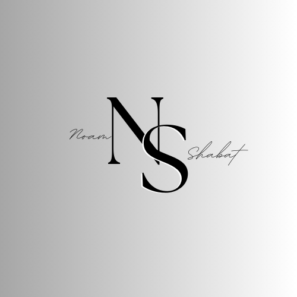

# 👨🏻‍💻 About Me

Hey there, I am <b>Noam Shabat</b> 👋🏽 <a href="#"></h1>

I'm a <b>Software Developer</b>, <b>Video Editor</b> & <b>Graphic Designer</b>, with over <b>3 years</b> of experience 
I am also a <b>student</b> at <b>[The Hebrew University of Jerusalem](https://en.huji.ac.il/en)</b>, Doing my Bachelor's in <b>Computer Science | Expected Graduation: 2025 🥇.  
As a Computer Science Student, I'm passionate about utilizing my knowledge of the latest technologies to make a positive difference in the world. 
 

## 🔨 Languages and Tools
<table width="65%">
<tr>
    <td align='center' width="150">
        
    </td>

  <td align='center' width="150">
        
    </td>
 <td align='center' width="150">
        
    </td>
 <td align='center' width="200">
        
    </td>
 <td align='center' width="200">
        
    </td>
</tr>

<tr>
    <td align='center' width="200">
        
    </td>
    <td align='center' width="200">
        
    </td>
 <td align='center' width="200">
        
    </td>
     <td align='center' width="200">
        
    </td>
    <td align='center' width="200">
        
    </td>
</tr>

<tr>
    <td align='center' width="200">
        
    </td>
    <td align='center' width="200">
        
    </td>
 <td align='center' width="200">
        
    </td>
  <td align='center' width="200">
         
    </td>
      <td align='center' width="200">
          
    </td>
</tr>
</table>
 

## 📬 Contact me

  
    
    

 

## 🌟 Other

  
Some Statistics

  

    &nbsp;&nbsp;&nbsp;
    &nbsp;&nbsp;
    &nbsp;&nbsp;&nbsp;
  

## 🐛Github Game

  

